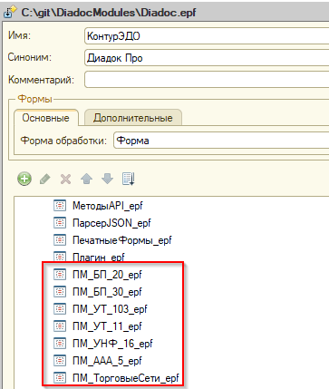
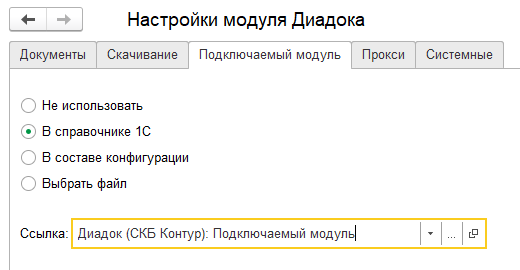

Работа подключаемого модуля
===========================

Подключаемый модуль (ПМ) - это вспомогательная внешняя обработка. ПМ содержит функции для обработки событий в зависимости от конфигурации 1С и бизнес-процессов организации.

В случае нехватки функционала стандартного модуля ПМ добавит новый сценарий.

Краткое описание
----------------

События подключаемого модуля
~~~~~~~~~~~~~~~~~~~~~~~~~~~~

К событиям подключаемого модуля относятся действия, которые:

- собирают данные из конфигурации 1С для их отправки на сервер Диадока
- обрабатывают полученные с сервера Диадок данные для их регистрации в базе 1С. Например, создание документа, регистрирующего поступление товаров на основании входящего УПД.

Точкой входа из основного модуля в подключаемый модуль является функция :doc:`ОбработатьСобытие <func/pm/Obrabotat'Sobytiye>`.

Обращение к необходимой функции происходит через условие "Если"

::

  Если ИмяСобытия = "ПолучитьТекстЗапросаДляСпискаПакетовНаОтправкуПоМассивуВидовПакетов" Тогда

    Возврат ПолучитьТекстЗапросаДляСпискаПакетовНаОтправкуПоМассивуВидовПакетов(Параметры);

Возможности подключаемого модуля
~~~~~~~~~~~~~~~~~~~~~~~~~~~~~~~~

Для типовых конфигураций в модуле описаны основные действия для работы с событиями пакетов документов:

* сбор документов 1С в один вид пакета
* заполнение контента на основании данных из 1С для отправки пакета
* логика сопоставления и создания документов в 1С

Кроме того, в ПМ можно описать функции для прочих действий, в том числе связанных со списком документов в основной форме:

* логика необходимого анализа входящих документов согласно бизнес-процессам организации
* действия после обновления списка документов
* выполнение регламентного задания
* сопоставление номенклатуры
* действия дополнительных кнопок и т.д.

Расположение подключаемого модуля
~~~~~~~~~~~~~~~~~~~~~~~~~~~~~~~~~

Типовые ПМ для основных конфигураций 1С располагаются в макетах основного модуля.

В настройках основной обработки модуля Диадока указывается путь к доработанному ПМ. Это упрощает настройку программы под бизнес-процессы каждого клиента.

Примеры использования подключаемого модуля
------------------------------------------

.. toctree::
  :name: ПМ
  :maxdepth: 4

  Исходящие: как подготовить пакет документов для отправки <proc/pm/Podgotovka_Paketa_Dlya_Otpravki>
  Исходящие: дополнительная обработка исходящих пакетов <proc/pm/Dop_Obrabotka_Iskhodyashchikh_Paketov>
  Входящие: как обработать входящий пакет документов <proc/pm/Obrabotka_Vkhodyashchikh_Paketov>
  Интерфейс: как доработать таблицу списка документов <proc/pm/Dorabotka_Spiska_Dokumentov>
  Интерфейс: как добавить кнопки в действия <proc/pm/Dobavleniye_Knopok>
  Регламентное задание <proc/pm/Reglamentnoye_Zadaniye>
  Дополнительные возможности <proc/pm/Dopolnitel'nyye_Vozmozhnosti>
