Как подготовить пакет документов для отправки
=============================================

Модуль Диадока для 1С умеет отправлять документы контрагентам. По одной сделке часто требуется отправить не один документ, а минимум два.

Поэтому документы объединяются в :doc:`Пакет <../../objects/Пакет>`. Состоять такой пакет может из нескольких документов доступных :doc:`типов <../../objects/Tipy_Dokumentov>`.

Аналогично веб-версии, одновременно нельзя отправить больше 30 документов.

Предварительно следует назвать пакет, определить состав и логику сбора документов. Каждый этап подготовки описывается в событии подключаемого модуля.

Определение пакетов на отправку
-------------------------------

Документы, которые будут отправлены вместе, отображаются в списке для отправки в одну строку.

Описание пакета берется из события подключаемого модуля :doc:`ПолучитьТаблицуИспользуемыхПакетов <../../func/pm/Poluchit'TablitsuIspol'zuyemykhPaketov>`.

На выходе получаем таблицу, которая определяет:

- название пакета для пользователя;
  
- название категории, к которой относится пакет (необязательное заполнение);
  
- документы, формат которых можно переопределить в пользовательских настройках (необязательное заполнение).

**Название пакета** можно задавать какое угодно. Главное, чтобы пользователю было понятно, что он отправит.
Например, согласно бизнес-логике («Возмещение») или типу документа («УПД»).

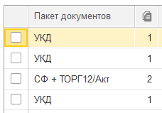

**Категория пакета** - группа видов пакетов, из которых формируется только один, например УПД или СФ+ТОРГ. Это разрешает включать или отключать вид пакета на отправку в настройках организации или контрагента.

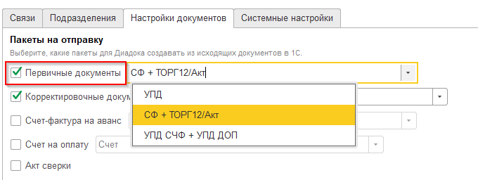

**Состав пакета** нужен для отображения списка документов в настройках документов организации или контрагента, которым можно:

- изменять формат формализованного, если предусмотрено в модуле;

- изменять на свою печатную форму в пользовательском режиме;

- добавлять внешнюю печатную форму, которая может формироваться на основании документа-основания 1С.

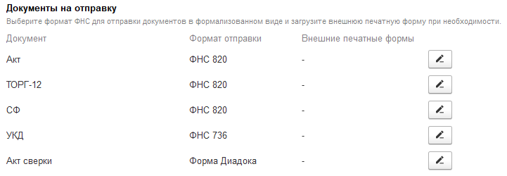

**Хранение:**

- на объектах Диадока в справочнике "Диадок: Дополнительные справочники" (Имя справочника = "ВидыПакетов");

- в типовом регистре дополнительных сведений таблица сохраняется в кэше сеанса по данным из подключаемого модуля.

**Пример заполнения:**

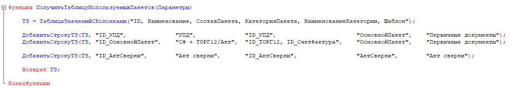

Форматы документов
------------------

При формировании документа важно знать какие передавать сведения, учитывать ограничения ФНС и др.

Для объединения похожих по структуре документов используются такие характеристики: :doc:`тип контента <../../objects/Tipy_Kontenta>`, функция и :doc:`тип документа <../../objects/Tipy_Dokumentov>` API.

Определение комбинаций этих характеристик ("видов документов"), которые будут использованы в пакетах на отправку, происходит в функции :doc:`ПолучитьТаблицуИспользуемыхВидовДокументов <../../func/pm/Poluchit'TablitsuIspol'zuyemykhVidovDokumentov>`

**Хранение:**

Хранение на объектах Диадока:

* на объектах Диадока в справочнике "Диадок: Дополнительные справочники" (Имя справочника = "ВидыПакетов");

* в типовом регистре дополнительных сведений таблица сохраняется в кэше сеанса по данным из подключаемого модуля.

**Определим форматы на следующих примерах:**

- формализованный УПД;
- формализованный иУПД, формат которого зависит от УПД;
- полуформализованный Счет на оплату.

**Для этого используем такой код:**

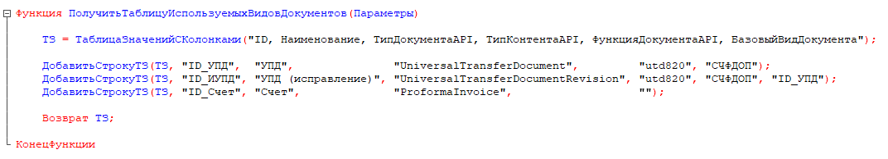

Заполнение списка пакетов на отправку
-------------------------------------

Построение запроса для заполнения списка пакетов на отправку происходит в функции :doc:`ПолучитьТекстЗапросаДляСпискаПакетовНаОтправкуПоМассивуВидовПакетов <../../func/pm/Poluchit'TekstZaprosaDlyaSpiskaPaketovNaOtpravkuPoMassivuVidovPaketov>`.

Логика заполнения пакета предусматривает наличие одного главного документа, без которого отправлять контрагенту остальные не имеет смысла.

Сколько таких документов будет выбрано в запросе, столько пакетов и будет сформировано на отправку.

Пример выбора счетов-фактур из 1С для формирования вида пакета «УПД»:

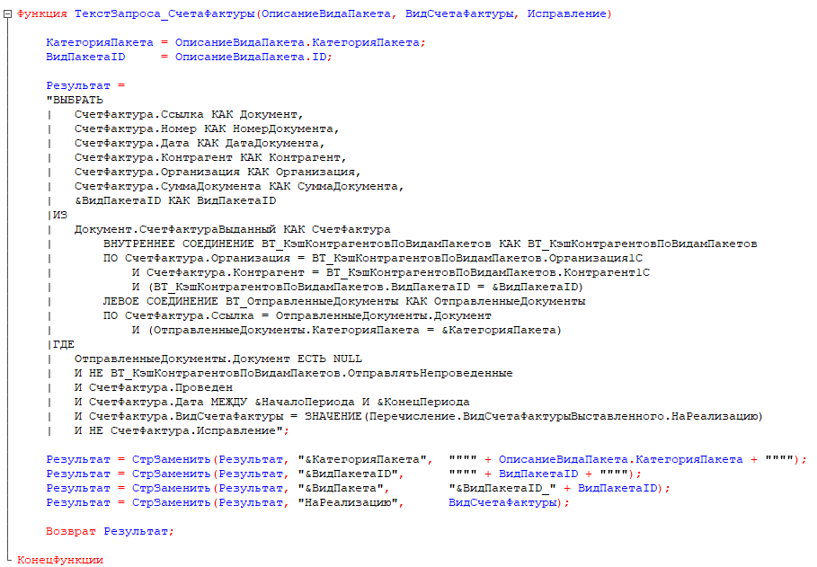

Состав пакетов
--------------

Наполнение документами происходит в функции :doc:`ПодготовитьПакет <../../func/pm/Podgotovit'Paket>`.

Для каждого вида пакета вычисляются ссылки на документы 1С, которые стоит подготовить и добавить в электронном виде.

Это может быть только главный документ, либо связанные с ним документы и т.п.

В качестве параметров передаются:

* структура пакета, в который добавляется документ;
* ссылка на документ 1С, по сведениям которого будет сформирован электронный документ;
* внутренний идентификатор вида документов, в формате которого будет сформирован электронный документ;
* дополнительный параметр, который будет передан в функцию по формированию электронного документа (необязательный).

Пользователю видны подготовленные документы в форме пакета на отправку.

Пример определения состава пакетов:

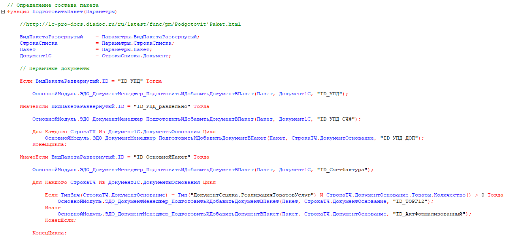

Формирование электронного документа
-----------------------------------

Электронный документ состоит из метаданных и контента, заполнение которых происходит в функции :doc:`ПодготовитьЭлектронныйДокумент <../../func/pm/Podgotovit'ElektronnyyDokument>`.

Описание требуется для каждого вида документа или типа контента, которые используются при отправке.

Формализованный
~~~~~~~~~~~~~~~

Сбор контента для формализованных документов проще всего сделать с помощью метода основного модуля "ТиповойМодуль_ПолучитьКонтент".

В параметрах передается ссылка на документ 1С и тип контента, который надо собрать. Если это УПД или УКД, то в дополнительных параметрах стоит указать функцию.

Полученную структуру переводим в объект XDTO с помощью метода основного модуля "ЗаполнитьКонтентXDTOПоСтруктуре".

Пример типового сбора контента для документов типа "УПД":

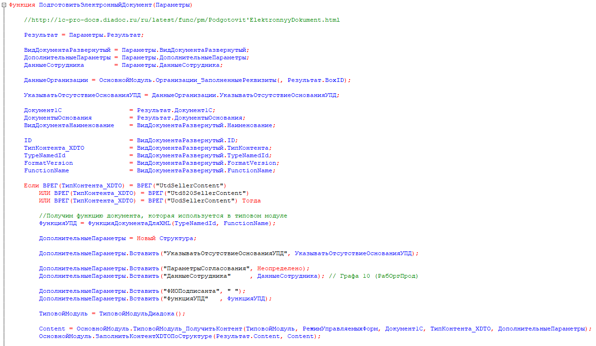

Если документ 1С доработан или сбор контента для его типа не определен в модуле, то можно воспользоваться шаблоном кода.

В настройке модуля на закладке "Подключаемый модуль" при нажатии на кнопку "Генерировать пример подключаемого модуля" откроется вспомогательная форма.

В этой форме надо отметить галочкой нужный формат документа и нажать "Сгенерировать шаблон кода ПМ".

Определение значений полей в формате приказа №820 есть в :doc:`документации <../../objects/Utd820SellerContent>`.

Пример заполнения контента продавца в формате приказа №820 (Utd820SellerContent):

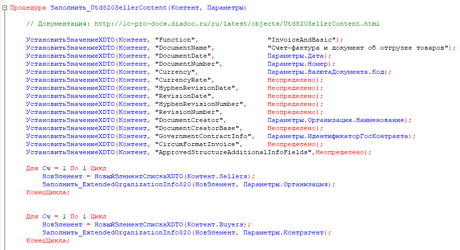

Неформализованные документы
~~~~~~~~~~~~~~~~~~~~~~~~~~~~

Для неформализованных документов заполняется мета и файл.

Мета содержит сведения о номере, дате документа, имени файла и т.д. в зависимости от типа документа.

Получить двоичные данные файла можно несколькими способами:

* с помощью метода основного модуля "ТиповойМодуль_СформироватьПечатнуюФорму" для типовых печатных форм документов "Счет на оплату" и "Акта сверки";

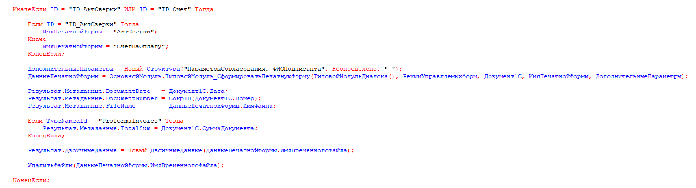

* с помощью метода "СформироватьВнешнююПечатнуюФорму" для внешних печатных форм;

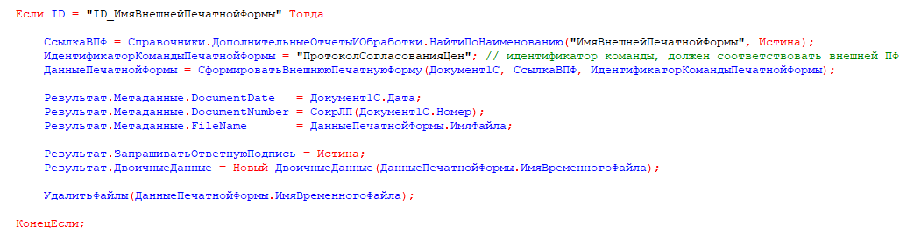

* стандартными функциями из объектов 1С, например "ПрисоединенныеФайлы.ПолучитьДвоичныеДанныеФайла".

Отправка пакета-шаблона
-----------------------

Пакет-шаблон - это сообщение с шаблонами, на основании которых можно создать юридически значимые документы.

Для отправки таких пакетов необходимо выполнить следующее:

* Добавить необходимый вид пакета-шаблона в функции :doc:`ПолучитьТаблицуИспользуемыхПакетов <../../func/pm/Poluchit'TablitsuIspol'zuyemykhPaketov>`.

::

  ТЗ  = Новый ТаблицаЗначений;
  ОсновнойМодуль.ЭДО_Служебные_ДобавитьКолонкиВТаблицуЗначений(ТЗ, "ID, Наименование, Шаблон");
  ОсновнойМодуль.ЭДО_Служебные_ДобавитьСтрокуВТаблицуЗначений(ТЗ, "ID_Шаблоны_КС2_КС3",	"Шаблоны КС2, КС3", Истина);

* Заполнить **ПараметрыШаблона** структуры :doc:`Пакет <../../objects/Пакет>` в функции :doc:`ПодготовитьПакет <../../func/pm/Podgotovit'Paket>`.

::

  Если ВидПакетаРазвернутый.ID = "ID_Шаблоны_КС2_КС3" Тогда

    // Документы должен подготовить получатель шаблона
    Пакет.ПараметрыШаблона.MessageFromBoxId = Пакет.ДанныеДД.CounterAgentId;
    Пакет.ПараметрыШаблона.MessageToBoxId	  = Пакет.ДанныеДД.OrganizationId;

    // Документы должны быть отправлены все вместе в одном сообщении,
    // подписать или отклонить документы можно разными сообщениями
    Пакет.ПараметрыШаблона.LockMode = "Send";

  КонецЕсли

* Если поля документа созданного на основании шаблона требуется дозаполнить, то необходимо указать соотвествующий идентификатор настройки редактирования **ПараметрыШаблона.EditingSettingId** в функции :doc:`ПодготовитьЭлектронныйДокумент <../../func/pm/Podgotovit'ElektronnyyDokument>`.

::

  Если ВидДокументаРазвернутый.ID = "ID_Шаблон_УПД_БезДатыНомера" Тогда
    Результат.ПараметрыШаблона.EditingSettingId = "ab30afed-e04f-4309-9b15-51a77f55e183";
  КонецЕсли;

Если идентификатор настройки редактирования заполнен, то модуль не будет выполнять валидацию контента шаблона.

Отправка дополнительной печатной формы
--------------------------------------

В настройках организации / контрагента есть возможность к виду документа привязать отправку дополнительных печатных форм.

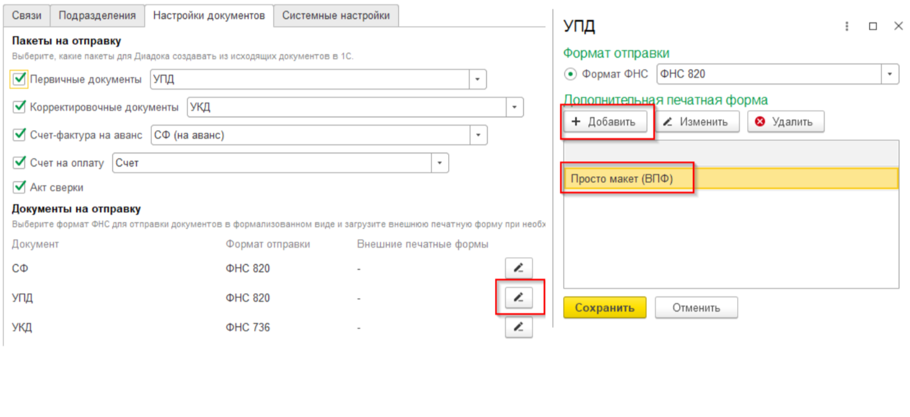

С такой настройкой при формировании пакета, в составе которого есть УПД, в пакет будет добавляться еще и внешняя печатная форма, как отдельный неформализованный документ.

Влиять на формирование такого документа можно в событии :doc:`ПодготовитьЭлектронныйДокументПоВнешнейПечатнойФорме <../../func/pm/ПодготовитьЭлектронныйДокументПоВнешнейПечатнойФорме>`.
Например, можно переопределить документ, на основании которого формируется печатная форма.

Пример подготовки печатной формы:

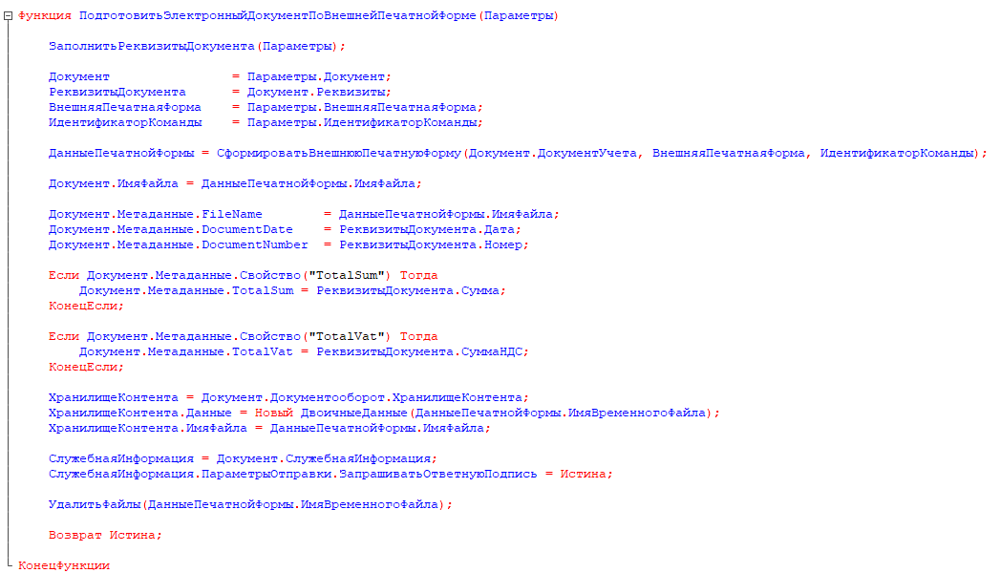

Заполнение реквизитов документов в списке на отправку
-----------------------------------------------------

В списке документов на отправку возможно два режима просмотра:

* по пакетам,

* развернуто по документам пакета.

Режим просмотра регулируется настройкой модуля *Расширенные настройки → Документы → Показывать содержимое пакета на отправку*.

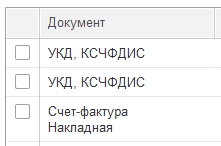

Для заполнения списка необходимо определить дату, номер и сумму каждого документа пакета. Способ их определения без заполнения контента определяется в событии :doc:`ЗаполнитьРеквизитыДокумента <../../func/pm/ЗаполнитьРеквизитыДокумента>`.

Пример заполнения полей:

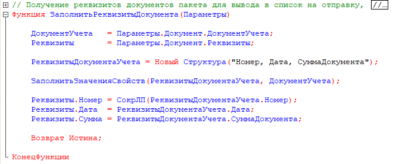
